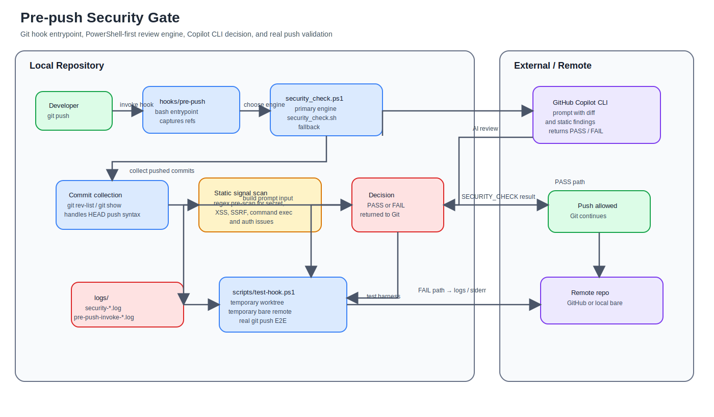

# Ag_hook_Security

Git の `pre-push` フックで GitHub Copilot CLI を呼び出し、プッシュ直前にセキュリティレビューを実施する検証用ワークスペースです。既定の実行エンジンは PowerShell 7 版で、bash 版は同等機能のフォールバックとして残しています。

公開リポジトリ:

- https://github.com/aktsmm/pre-push-security-gate

## 何をするか

- `git push` の直前に、これから送るコミット差分を抽出します。
- `copilot -p` に差分とチェック観点を渡して、セキュリティレビューを実行します。
- `SECURITY_CHECK: FAIL` が返った場合は push を止め、Copilot の指摘と修正案を表示します。
- `SECURITY_CHECK: PASS` が返った場合は push を通します。
- すべての実行結果を `logs/` に保存します。
- Git フック自体は `hooks/pre-push` の薄いラッパーで、`pwsh` / `pwsh.exe` があれば [scripts/security_check.ps1](scripts/security_check.ps1) を優先実行し、なければ [scripts/security_check.sh](scripts/security_check.sh) にフォールバックします。

## Hook の説明

`git push` が呼ばれると、Git は [hooks/pre-push](hooks/pre-push) を実行します。このフックは push 先の remote 名と URL を受け取り、stdin で渡される ref 情報を一時ファイルへ退避してからレビュー本体を呼び出します。

役割分担:

- [hooks/pre-push](hooks/pre-push): Git から最初に呼ばれるエントリポイント。PowerShell 7 を優先し、必要なら bash 版にフォールバックする
- [scripts/security_check.ps1](scripts/security_check.ps1): 正本のレビュー実装。commit 収集、差分生成、Copilot CLI 呼び出し、PASS/FAIL 判定を担当する
- [scripts/security_check.sh](scripts/security_check.sh): bash 向けフォールバック実装。PowerShell 7 がない環境でも同じロジックで動く
- [scripts/test-hook.ps1](scripts/test-hook.ps1): 実際の `git push` 経路まで含めた E2E テストを担当する

レビューの流れ:

1. `pre-push` が remote と ref 情報を受け取る
2. review script が push 対象 commit を列挙する
3. diff と静的シグナルをまとめて Copilot CLI に渡す
4. Copilot の返答から `SECURITY_CHECK: PASS` / `FAIL` を判定する
5. FAIL なら push を止め、PASS なら remote 更新へ進める

補足:

- `git push origin HEAD:refs/heads/main` のように local ref が `HEAD` でも、remote ref を見て branch push として扱うようにしています
- 意図的に脆弱な `demo/` コードを含むため、このリポジトリ自身の公開や seed では `SKIP_COPILOT_SECURITY_HOOK=1` を明示的に使う場面があります

## アーキテクチャ



画像ファイル:

- [outputs/pre-push-security-gate-architecture.drawio.svg](outputs/pre-push-security-gate-architecture.drawio.svg)

編集元 drawio:

- [outputs/pre-push-security-gate-architecture.drawio](outputs/pre-push-security-gate-architecture.drawio)

見どころ:

- Git の `pre-push` フックは bash ラッパーだが、実際のレビューエンジンは PowerShell 7 が正本
- commit 差分生成と regex ベースの静的シグナル収集はローカルで完結する
- AI 判定は Copilot CLI に集約し、最終的な allow / block を hook が Git に返す
- 実運用テストはローカル bare remote を使って「本物の `git push`」で検証できる

## ベストプラクティス上の位置付け

このリポジトリは「ローカルでの早期フィードバック」を目的にしています。`pre-push` フックは便利ですが、以下の理由で単独では本番ゲートになりません。

- ローカルフックは `--no-verify` などで迂回できます。
- 各開発者のローカル環境に依存します。
- Copilot CLI やネットワークの状態に影響されます。

本番で運用するなら、以下と組み合わせるのが前提です。

- GitHub branch protection
- 必須ステータスチェック
- GitHub Actions / CodeQL / dependency scan / secret scan
- 重要ブランチへのレビュー必須化

参考:

- Git hooks: https://git-scm.com/docs/githooks#_pre_push
- GitHub Copilot CLI: https://docs.github.com/en/copilot/how-tos/copilot-cli

## まず試す手順

このリポジトリを他の人に試してもらうときは、まず次の 2 コマンドを案内すれば十分です。

```powershell
./setup.ps1
./scripts/test-hook.ps1
```

期待結果:

- FAIL シナリオ: 脆弱デモを含む履歴に対して `SECURITY_CHECK: FAIL` が出て、remote 側には branch が作られない
- PASS シナリオ: テストスクリプトが一時 worktree 上で作る harmless commit に対して `PASS: security review passed.` が出て、remote 側の branch 更新が通る

このスクリプトはメイン作業ツリーを汚さず、Git worktree とローカル bare remote を一時的に作って検証したあと自動で掃除します。PowerShell 本体だけでなく、実際の `git push` 経路まで確認します。

## セットアップ

前提:

- Git for Windows（Git Bash を含む）
- GitHub CLI
- PowerShell 7 (`pwsh` または `pwsh.exe`)
- standalone の `copilot` コマンドが使える状態

推奨手順:

```powershell
./setup.ps1
```

Git Bash から入れる場合:

```bash
bash setup.sh
```

これで `.git/hooks/pre-push` にフックがインストールされます。

## テスト方法

### 自動テスト

PowerShell 7 から次を実行します。

```powershell
./scripts/test-hook.ps1
```

FAIL シナリオだけ試したい場合:

```powershell
./scripts/test-hook.ps1 -Scenario fail
```

PASS シナリオだけ試したい場合:

```powershell
./scripts/test-hook.ps1 -Scenario pass
```

テストスクリプトが行うこと:

- 一時 worktree を作る
- 一時 bare remote を作る
- その worktree に `./setup.ps1` を適用する
- `.git/hooks/pre-push` が作られたことを確認する
- full history を実際に `git push` して FAIL を確認し、remote が更新されないことを確認する
- harmless commit を 1 つ作って実際に `git push` し、PASS と remote 更新を確認する
- worktree とテスト用 branch を自動削除する

### 手動テスト

1. `./setup.ps1` を実行する
2. FAIL を見たい場合は、脆弱デモを含む履歴全体を対象にする
3. PASS を見たい場合は、安全な小差分だけを 1 commit 作る
4. [scripts/security_check.ps1](scripts/security_check.ps1) または [hooks/pre-push](hooks/pre-push) を手動実行する

FAIL の手動確認例:

```powershell
$head = (git rev-parse HEAD).Trim()
$refs = New-TemporaryFile
"refs/heads/main $head refs/heads/main 0000000000000000000000000000000000000000" | Set-Content -LiteralPath $refs -Encoding utf8
pwsh -NoProfile -File ./scripts/security_check.ps1 origin https://example.invalid/repo.git $refs
Remove-Item $refs
```

PASS の手動確認例:

```powershell
$base = (git rev-parse HEAD).Trim()
Add-Content -LiteralPath ./demo/safe_js/test-pass-marker.txt -Value (Get-Date -Format s)
git add ./demo/safe_js/test-pass-marker.txt
git commit -m "test: harmless change"
$head = (git rev-parse HEAD).Trim()
$refs = New-TemporaryFile
"refs/heads/main $head refs/heads/main $base" | Set-Content -LiteralPath $refs -Encoding utf8
pwsh -NoProfile -File ./scripts/security_check.ps1 origin https://example.invalid/repo.git $refs
Remove-Item $refs
```

## ブランチ対象の切り替え

デフォルトでは全ブランチをチェックします。対象切り替えは本筋の [scripts/security_check.ps1](scripts/security_check.ps1) の `Should-CheckRef` 関数で行います。bash 版も [scripts/security_check.sh](scripts/security_check.sh) の `should_check_ref` に同じロジックを持っています。

すでにコメントで `main` / `master` のみを対象にする例を入れてあります。そこを置き換えるだけで切り替えできます。

## 失敗時の扱い

- デフォルトは fail-close です。Copilot CLI に失敗した場合も push を止めます。
- 一時的に fail-open にしたい場合:

```powershell
$env:SECURITY_HOOK_FAIL_OPEN = '1'
git push
Remove-Item Env:SECURITY_HOOK_FAIL_OPEN
```

- ローカル検証でフック自体をスキップしたい場合:

```powershell
$env:SKIP_COPILOT_SECURITY_HOOK = '1'
git push
Remove-Item Env:SKIP_COPILOT_SECURITY_HOOK
```

- bash では従来どおり `SECURITY_HOOK_FAIL_OPEN=1 git push` や `SKIP_COPILOT_SECURITY_HOOK=1 git push` でも実行できます。

## ログ

ログは `logs/security-YYYYMMDD-HHMMSS.log` に出力されます。

記録内容:

- 実行日時
- 対象 remote / ref
- 対象ファイル
- Copilot への実行コマンド種別
- Copilot の生出力
- 最終結果

## デモ素材

- [demo/vulnerable_python/app.py](demo/vulnerable_python/app.py): SQL injection, command injection, hardcoded secret
- [demo/vulnerable_js/app.js](demo/vulnerable_js/app.js): XSS, SSRF, hardcoded secret, broken auth
- [demo/safe_js/app.js](demo/safe_js/app.js): 通過確認用の小さな安全側サンプル

## 推奨デモ手順

1. `./setup.ps1` を実行する
2. まず脆弱デモを含む commit を作る
3. PowerShell 版本体を手動実行するか、ダミー remote に push して失敗を確認する
4. 次に安全な差分だけを作って PASS を確認する

PowerShell 版本体を手動で再現したい場合の例:

```powershell
$head = (git rev-parse HEAD).Trim()
$refs = New-TemporaryFile
"refs/heads/main $head refs/heads/main 0000000000000000000000000000000000000000" | Set-Content -LiteralPath $refs -Encoding utf8
pwsh -NoProfile -File ./scripts/security_check.ps1 origin https://example.invalid/repo.git $refs
Remove-Item $refs
```

フックラッパー経由で再現したい場合の例:

```powershell
$head = (git rev-parse HEAD).Trim()
"refs/heads/main $head refs/heads/main 0000000000000000000000000000000000000000" | bash ./.git/hooks/pre-push origin https://example.invalid/repo.git
```

bash だけで再現したい場合の例:

```bash
printf 'refs/heads/main %s refs/heads/main %040d\n' "$(git rev-parse HEAD)" 0 | .git/hooks/pre-push origin https://example.invalid/repo.git
```

## チーム向け案内文

リポジトリを配るときは、次のように案内すると揃えやすいです。

```text
1. PowerShell 7 と GitHub Copilot CLI を入れる
2. リポジトリ直下で ./setup.ps1 を実行する
3. ./scripts/test-hook.ps1 を実行する
4. FAIL と PASS の両方が出ることを確認する
5. 失敗したら logs/ の最新ログを共有する
```

共有してもらうとよい情報:

- OS とシェル（pwsh / Git Bash）
- `copilot --version`
- `pwsh --version`
- 実行したコマンド
- `logs/` の最新ファイル

## 実装メモ

- push フックは `.git` 配下で実行されるため、スクリプト側で `git rev-parse --show-toplevel` を使ってリポジトリルートを解決しています。
- PowerShell 版を正本とし、Git からは bash ラッパー経由で PowerShell 7 を優先起動します。
- `copilot` コマンドを優先して使います。`gh copilot` しかない環境は旧インターフェイスの可能性があるため、非対話レビュー用途では推奨しません。
- Copilot へのプロンプトが肥大化しないように、差分パッチは文字数上限で切り詰めています。
- 軽量な regex ベースのプリスキャン結果も Copilot に渡して、代表的な危険シグナルを補助的に拾います。
